# Email Parsing MCP Server with AI Integration

A modern Python application for parsing .msg email files and standardizing their content using an MCP (Model Context Protocol) server, enhanced with local AI analysis powered by Ollama Phi3.

## 🏗️ System Architecture

> **Note**: If diagrams don't render in your editor, they will display correctly on GitHub. You can also view them at [mermaid.live](https://mermaid.live/) by copying the diagram code.


### **Simplified Architecture View**
```
┌─────────────────────────────────────────────────────────────────┐
│                        CLIENT LAYER                             │
│  ┌──────────┐  ┌─────────────┐  ┌─────────┐  ┌──────────────┐   │
│  │   CLI    │  │   Claude    │  │ Web App │  │  Dashboard   │   │
│  │Interface │  │  Desktop    │  │ Client  │  │   Client     │   │
│  └──────────┘  └─────────────┘  └─────────┘  └──────────────┘   │
└─────────────────────────────────────────────────────────────────┘
                                 │
┌─────────────────────────────────────────────────────────────────┐
│                      TRANSPORT LAYER                            │
│  ┌──────────┐  ┌─────────────┐  ┌─────────────────────────────┐ │
│  │   MCP    │  │ HTTP REST   │  │       WebSocket             │ │
│  │  Server  │  │    API      │  │        Server               │ │
│  └──────────┘  └─────────────┘  └─────────────────────────────┘ │
└─────────────────────────────────────────────────────────────────┘
                                 │
┌─────────────────────────────────────────────────────────────────┐
│                    CORE PROCESSING LAYER                        │
│  ┌─────────────────────────────────────────────────────────────┐ │
│  │                    7 MCP TOOLS                             │ │
│  │  Traditional: parse_file, parse_folder, analyze_patterns   │ │
│  │  AI-Powered: ai_analyze_file, ai_analyze_text, ai_categorize│ │
│  └─────────────────────────────────────────────────────────────┘ │
└─────────────────────────────────────────────────────────────────┘
                                 │
┌─────────────────────────────────────────────────────────────────┐
│                    PROCESSING ENGINES                           │
│  ┌──────────────┐  ┌─────────────────┐  ┌──────────────────┐    │
│  │    Email     │  │   AI Analyzer   │  │     Entity       │    │
│  │    Parser    │  │  (Ollama Phi3)  │  │   Extractor      │    │
│  │ (extract-msg)│  │                 │  │ (Regex Patterns) │    │
│  └──────────────┘  └─────────────────┘  └──────────────────┘    │
└─────────────────────────────────────────────────────────────────┘
                                 │
┌─────────────────────────────────────────────────────────────────┐
│                        DATA LAYER                               │
│  ┌──────────────┐  ┌─────────────────┐  ┌──────────────────┐    │
│  │  .msg Files  │  │ Organized Output│  │ Ollama Service   │    │
│  │   (Input)    │  │    (JSON)       │  │   (Phi3 Model)   │    │
│  └──────────────┘  └─────────────────┘  └──────────────────┘    │
└─────────────────────────────────────────────────────────────────┘
```

## 🔄 Email Processing Flow

> **Note**: Interactive diagram available at [mermaid.live](https://mermaid.live/) - copy the code below to visualize.

```mermaid
flowchart TD
    Start([Email Processing Request]) --> Check{Input Type?}
    
    Check -->|Single File| ParseSingle[Parse Single .msg File]
    Check -->|Folder| ParseFolder[Parse Folder of .msg Files]
    Check -->|Text| ParseText[Process Raw Text]
    
    ParseSingle --> Extract[Extract Email Content<br/>• Subject, Sender, Recipients<br/>• Body Text/HTML<br/>• Attachments<br/>• Metadata]
    
    ParseFolder --> Batch[Batch Process Files<br/>• Iterate through .msg files<br/>• Collect statistics<br/>• Generate summaries]
    
    ParseText --> Direct[Direct Text Processing<br/>• Entity extraction<br/>• Pattern analysis]
    
    Extract --> Traditional[Traditional Analysis<br/>🔍 Entity Extraction<br/>📊 Category Classification<br/>📈 Correlation Scoring]
    
    Batch --> Traditional
    Direct --> Traditional
    
    Traditional --> AICheck{AI Analysis<br/>Requested?}
    
    AICheck -->|Yes| AIProcess[AI Analysis with Phi3<br/>🤖 Smart Summarization<br/>😊 Sentiment Analysis<br/>⚡ Priority Scoring<br/>💡 Key Insights<br/>✅ Action Items]
    
    AICheck -->|No| Format[Format Output<br/>📋 Summary<br/>📄 Detailed<br/>📱 JSON]
    
    AIProcess --> Combine[Combine Results<br/>Traditional + AI Analysis<br/>Confidence Scoring]
    
    Combine --> Format
    
    Format --> Output[Structured Output<br/>🗂️ Auto-organized folders<br/>⏰ Timestamped files<br/>📊 Statistics & insights]
    
    Output --> End([Complete])

    %% Styling for better visibility on dark/light themes
    classDef startEnd fill:#c8e6c9,stroke:#2e7d32,stroke-width:3px,color:#000
    classDef process fill:#e3f2fd,stroke:#1565c0,stroke-width:2px,color:#000
    classDef decision fill:#fff8e1,stroke:#ef6c00,stroke-width:3px,color:#000
    classDef ai fill:#f3e5f5,stroke:#6a1b9a,stroke-width:2px,color:#000

    class Start,End startEnd
    class ParseSingle,ParseFolder,ParseText,Extract,Batch,Direct,Traditional,Format,Output process
    class Check,AICheck decision
    class AIProcess,Combine ai
```



### **Simplified Processing Flow**
```
    📥 Email Input
         │
    ┌────▼────┐
    │ Extract │ ── Subject, Sender, Body, Attachments
    │Content  │
    └────┬────┘
         │
   ┌─────▼─────┐
   │Traditional│ ── 📧 Entity Extraction
   │ Analysis  │ ── 🏷️ Category Classification  
   └─────┬─────┘ ── 📊 Correlation Scoring
         │
    ┌────▼────┐
    │AI Check?│ ──── No ──┐
    └─────────┘           │
         │ Yes            │
    ┌────▼────┐           │
    │   AI    │ ── 🤖 Smart Summary      │
    │Analysis │ ── 😊 Sentiment Analysis │
    │ (Phi3)  │ ── ⚡ Priority Scoring   │
    └────┬────┘ ── 💡 Key Insights       │
         │                              │
    ┌────▼────┐                         │
    │ Combine │ ◄──────────────────────┘
    │ Results │
    └────┬────┘
         │
    ┌────▼────┐
    │ Format  │ ── 📋 Summary / 📄 Detailed / 📱 JSON
    │ Output  │
    └────┬────┘
         │
    📁 Organized Output
    ├── 📧 emails/     (Individual parsing results)  
    ├── 📊 analysis/   (AI insights & patterns)
    ├── 🏷️ entities/   (Extracted entities)
    └── 📋 reports/    (Comprehensive analysis)
```

## ✨ Features

### 🎯 **Core Capabilities**
- **Email Parsing**: Parse .msg files and extract structured content
- **Content Standardization**: Convert subjective email content to standardized format
- **Entity Extraction**: Identify emails, phone numbers, dates, URLs, and monetary amounts
- **Correlation Analysis**: Analyze relationships between subject, body, and attachments
- **Category Classification**: Automatically categorize emails by content type
- **Pattern Analysis**: Analyze patterns across multiple emails

### 🤖 **AI-Powered Features**
- **Smart Summarization**: AI-generated concise email summaries
- **Intelligent Categorization**: Semantic understanding beyond keyword matching
- **Sentiment Analysis**: Emotional tone detection (positive, negative, neutral, concerned)
- **Priority Scoring**: AI-driven urgency assessment (0.0-1.0 scale)
- **Action Item Extraction**: Natural language understanding of tasks and requests
- **Key Insight Detection**: Business intelligence from email content

### 🌐 **Multiple Access Methods**
- **CLI Interface**: Complete command-line tool with all features
- **MCP Server**: Model Context Protocol for Claude Desktop integration
- **HTTP REST API**: RESTful endpoints for web applications
- **WebSocket Server**: Real-time processing for live dashboards

## 🚀 Quick Start

### **Prerequisites**
- Python 3.12+
- uv package manager
- Ollama with Phi3 model (for AI features)

### **Setup**
1. **Clone and setup:**
```bash
./setup.sh
source .venv/bin/activate
```

2. **Install Ollama and Phi3 (for AI features):**
```bash
# Install Ollama
curl -fsSL https://ollama.com/install.sh | sh

# Pull Phi3 model
ollama pull phi3

# Start Ollama service
ollama serve
```

3. **Test the system:**
```bash
# Basic email parsing
python email_cli.py parse-file "./examples/sample_emails/(KH) Leaver - BUPA - Malik Bem.msg" --format summary

# AI-powered analysis
python email_cli.py ai-analyze file "./examples/sample_emails/(KH) Leaver - BUPA - Malik Bem.msg" --format json --auto-save
```

## 📖 Usage Guide

### **🖥️ CLI Interface**

#### **Traditional Email Processing**
```bash
# Parse single email file
python email_cli.py parse-file email.msg --format json --auto-save

# Batch process folder
python email_cli.py parse-folder ./emails --format detailed --auto-save

# Analyze email patterns
python email_cli.py analyze-patterns ./emails --type categories --format summary

# Extract entities from text
python email_cli.py extract-entities --text "Contact john@example.com at 555-123-4567"
```

#### **🤖 AI-Powered Analysis**
```bash
# AI analyze single email
python email_cli.py ai-analyze file email.msg --format json --auto-save

# AI analyze arbitrary text
python email_cli.py ai-analyze text --text "Urgent: Budget approval needed by Friday"

# Smart batch categorization
python email_cli.py ai-analyze categorize ./emails --format detailed --auto-save
```

#### **🌐 Server Modes**
```bash
# MCP server for Claude Desktop
python email_cli.py server --mcp

# HTTP REST API server
python email_cli.py server --http --port 8000

# WebSocket server for real-time apps
python email_cli.py server --websocket --port 8001
```

### **🔌 MCP Integration with Claude Desktop**

Add to your Claude Desktop configuration:
```json
{
  "mcpServers": {
    "email-parser": {
      "command": "python",
      "args": ["email_cli.py", "server", "--mcp"],
      "cwd": "/path/to/email-parser"
    }
  }
}
```

**Available MCP Tools:**
- `parse_email_file` - Parse single .msg file
- `parse_email_folder` - Batch process folders
- `analyze_email_patterns` - Pattern analysis
- `extract_entities_from_text` - Entity extraction
- `ai_analyze_email_file` - AI-powered email analysis
- `ai_analyze_text` - AI text analysis
- `ai_smart_categorize_folder` - Smart batch AI processing

### **🌐 HTTP API Endpoints**

Start HTTP server: `python email_cli.py server --http --port 8000`

```bash
# Parse single file
curl -X POST http://localhost:8000/api/parse/file \
  -H "Content-Type: application/json" \
  -d '{"file_path": "./email.msg", "format": "detailed"}'

# AI analysis
curl -X POST http://localhost:8000/api/ai/analyze-file \
  -H "Content-Type: application/json" \
  -d '{"file_path": "./email.msg"}'

# Pattern analysis
curl -X POST http://localhost:8000/api/analyze/patterns \
  -H "Content-Type: application/json" \
  -d '{"folder_path": "./emails", "analysis_type": "categories"}'
```

## 📊 Output Organization

The system automatically organizes outputs in structured folders:

```
output/
├── emails/          # Individual email parsing results
├── analysis/        # Pattern analysis and AI insights
├── entities/        # Entity extraction results
└── reports/         # Comprehensive analysis reports
```

**File naming:** `category_description_YYYYMMDD_HHMMSS.json`

## 🛠️ Development

### **Setup Development Environment**
```bash
# Install with development dependencies
uv pip install -e ".[dev,ai,network]"

# Install pre-commit hooks
pre-commit install
```

### **Code Quality**
```bash
# Run tests
python -m pytest tests/

# Format code
black src/ && isort src/

# Type checking
mypy src/

# Linting
flake8 src/ --max-line-length=88
```

### **Available Make Commands**
```bash
make help     # Show all available commands
make test     # Run test suite
make format   # Format code
make lint     # Run linting
make clean    # Clean generated files
```

## 📋 Requirements

### **System Requirements**
- **Python**: 3.12+ 
- **Package Manager**: uv (recommended) or pip
- **Memory**: 4GB+ (8GB+ recommended for AI features)
- **Storage**: 2GB+ (for Phi3 model)

### **Dependencies**
- **Core**: `extract-msg`, `fastmcp`, `python-dateutil`
- **Network**: `fastapi`, `uvicorn`, `websockets` (optional)
- **AI**: `ollama`, `requests` (optional)
- **Dev**: `pytest`, `black`, `mypy`, `flake8` (optional)

## 🎯 Use Cases

### **🏢 Enterprise Email Analysis**
- **Compliance Monitoring**: Analyze emails for regulatory compliance
- **Business Intelligence**: Extract insights from email communications
- **Workflow Automation**: Identify action items and priority tasks

### **🤖 AI Assistant Integration**  
- **Claude Desktop**: Direct integration with MCP tools
- **Custom AI Workflows**: Build intelligent email processing pipelines
- **Semantic Search**: AI-powered email categorization and insights

### **🔍 Email Forensics & Discovery**
- **Legal Discovery**: Extract structured data from email archives
- **Security Analysis**: Identify suspicious patterns and entities
- **Communication Patterns**: Analyze sender/recipient relationships

### **📊 Data Analytics**
- **Sentiment Tracking**: Monitor communication tone over time
- **Priority Analysis**: Identify high-impact communications
- **Entity Mapping**: Extract and correlate business entities

## 🤝 Contributing

We welcome contributions! Please see our contributing guidelines:

1. **Fork** the repository
2. **Create** a feature branch (`git checkout -b feature/amazing-feature`)
3. **Commit** your changes (`git commit -m 'Add amazing feature'`)
4. **Push** to the branch (`git push origin feature/amazing-feature`)
5. **Open** a Pull Request

### **Development Guidelines**
- Follow PEP 8 style guidelines
- Add tests for new features
- Update documentation as needed
- Ensure all tests pass before submitting

## 📜 License

This project is licensed under the MIT License - see the [LICENSE](LICENSE) file for details.

## 🙏 Acknowledgments

- **[extract-msg](https://github.com/TeamMsgExtractor/msg-extractor)** - Core .msg file parsing
- **[Ollama](https://ollama.com/)** - Local AI model hosting
- **[FastMCP](https://github.com/jlowin/fastmcp)** - Model Context Protocol implementation
- **[Phi3](https://huggingface.co/microsoft/Phi-3-mini-4k-instruct)** - Microsoft's efficient language model

## 📞 Support

For questions, issues, or feature requests:

- **GitHub Issues**: [Report bugs or request features](https://github.com/yourusername/email-parser/issues)
- **Documentation**: Check the comprehensive guides in the `/docs` folder
- **Community**: Join discussions in GitHub Discussions

---

**⭐ Star this repository if you find it helpful!**
